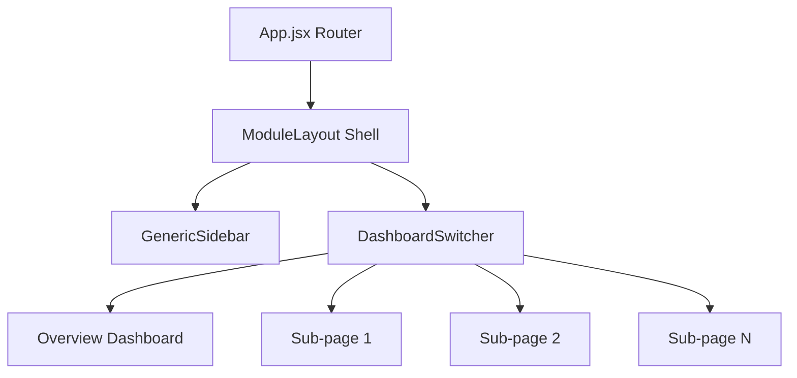
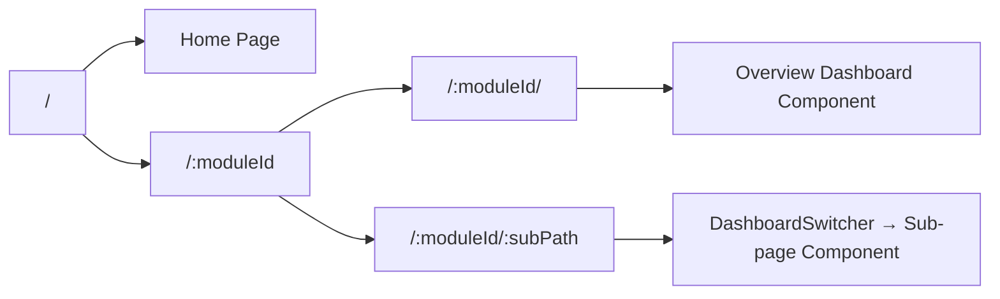

# AgroIndia — Complete Feature Walkthrough

> Comprehensive technical report covering every feature, workflow, and internal mechanism of the **Disease Detection** and **Crop Recommendation** modules.

---

## Module Architecture Overview

Both modules follow the same structural pattern:



- **Routing**: `App.jsx` captures `/:moduleId/:subPath?` and passes both params to `DashboardSwitcher`, which mounts the correct child component
- **Layout**: `ModuleLayout.jsx` provides the persistent navbar + sidebar chrome; child pages render inside a scrollable `#module-scroll-container`
- **Sidebar**: `GenericSidebar.jsx` reads menu definitions from [dashboardContent.js](file:///d:/HARIOM/Documents/AventIQ/agro-analytics/frontend/src/content/dashboardContent.js) keyed by `moduleId`

---

# 🌾 Module 1 — Crop Recommendation

**Module ID**: `crop-recommendation`
**Total Sub-pages**: 7 (1 dashboard + 6 tools)
**Sidebar Menu Source**: `dashboardContent.sidebarMenus["crop-recommendation"]`

---

## 1.1 Crop Recommendation Dashboard (Overview)

**File**: [CropRecommendationDashboard.jsx](file:///d:/HARIOM/Documents/AventIQ/agro-analytics/frontend/src/pages/crop-recommendation/CropRecommendationDashboard.jsx)
**Route**: `/crop-recommendation/`
**State**: Stateless (pure render from static data)

### What It Contains

| Section | Description |
|---------|-------------|
| **Header** | Bilingual title ("Crop Recommendation Dashboard / फसल अनुशंसा") with a "Sync Soil Data" button |
| **Auto-Detected Season Banner** | Green-tinted card showing the AI-detected growing season (Kharif), location (Faridabad, Haryana), and a pulsing "Telemetry Active" indicator |
| **Top 3 Crop Cards** | Grid of recommended crops with SVG circular match-score rings, yield predictions, ROI estimates, and risk badges |
| **Weather Sensor Array** | 4-panel grid showing Temperature, Humidity, Rainfall, and Wind Speed from sensor telemetry |

### How It Works

1. **Data Source**: All data is pulled from `dashboardContent.cropRecommendationData` — a static object in [dashboardContent.js](file:///d:/HARIOM/Documents/AventIQ/agro-analytics/frontend/src/content/dashboardContent.js)
2. **SVG Match Score Ring**: A custom `getCircleStrokeProps(score)` function calculates the SVG `stroke-dashoffset` for a circle of radius 24, rendering a proportional arc that visually represents the match percentage (e.g., 92% fills 92% of the ring)
3. **Best Match Highlight**: The crop with `isBestMatch: true` receives an elevated shadow (`shadow-xl`), a green-tinted border, and an absolute-positioned "RECOMMENDED" badge at the top
4. **Risk Badges**: Dynamic color logic — `'Low Risk'` renders emerald badges, anything else renders amber

### Key Data Flow
```
dashboardContent.js → cropRecommendationData.recommendedCrops[] → .map() render
                     → cropRecommendationData.weatherSummary → 4-panel grid
                     → cropRecommendationData.detectedBanner → season banner
```

---

## 1.2 Crop Ranking Engine

**File**: [CropRankingEngine.jsx](file:///d:/HARIOM/Documents/AventIQ/agro-analytics/frontend/src/pages/crop-recommendation/CropRankingEngine.jsx)
**Route**: `/crop-recommendation/crop-ranking`

### What It Contains

| Section | Description |
|---------|-------------|
| **Farm Inputs Matrix** (Left Panel) | Interactive form with 6 input controls for farm parameters |
| **Ranked Crop Scores** (Right Panel) | Sorted scoreboard of 9 crops with dynamic progress bars |
| **Legend** | Color-coded suitability index (Excellent → Moderate) |

### Interactive State Management

| State Variable | Type | Default | Control |
|---|---|---|---|
| `rainfall` | `number` | `420` | Range slider (100–1200 MM) |
| `temperature` | `number` | `28` | Range slider (10–45°C) |
| `soilType` | `string` | `'Loamy'` | Dropdown (7 soil types) |
| `waterAvailability` | `string` | `'Medium'` | 3-button radio group |
| `landArea` | `number` | `5` | Range slider (0.5–50 acres) |
| `district` | `string` | `'Faridabad'` | Dropdown (8 districts) |
| `isCalculating` | `boolean` | `false` | Triggered by "Recalculate" button |

### How It Works

1. **User Input**: The farmer adjusts 6 farm parameters via sliders, dropdowns, and radio buttons in the left panel
2. **Recalculate Action**: Clicking "Recalculate Matrix" sets `isCalculating = true`, showing a spinner animation and dimming the scoreboard (`opacity-40 pointer-events-none`) for 1200ms
3. **Ranking Display**: 9 crops from `CROP_RANKINGS[]` render as horizontal bar chart rows. Bar width = `score%`, bar color is determined by `getBarColor(score)`:
   - ≥85 → `#132a13` (Darkest forest green)
   - ≥75 → `#31572c`
   - ≥60 → `#4f772d`
   - ≥50 → `#90a955`
   - <50 → `#90a955` at 60% opacity
4. **Rank Badges**: Top 3 ranks get premium dark-green badges; rank 4+ get light neutral badges

> [!NOTE]
> The ranking data is currently static. The recalculate button simulates a 1.2s processing delay but does not actually re-sort the data. This is the integration point for a future ML model API.

---

## 1.3 Seasonal Agronomic Calendar

**File**: [SeasonalCalendar.jsx](file:///d:/HARIOM/Documents/AventIQ/agro-analytics/frontend/src/pages/crop-recommendation/SeasonalCalendar.jsx)
**Route**: `/crop-recommendation/seasonal-calendar`

### What It Contains

| Section | Description |
|---------|-------------|
| **Season Segmented Tabs** | 3-tab toggle: Kharif (खरीफ), Rabi (रबी), Zaid (जायद) |
| **Active Duration Banner** | Shows the month range of the selected season |
| **Climate Parameter Cards** | 3-card row: Avg Temperature, Avg Humidity, Agronomic Overview |
| **Timeline Rotational Matrix** | Full-width Gantt-style table mapping crops × months × farming phases |

### Interactive State Management

| State Variable | Type | Default | Description |
|---|---|---|---|
| `activeSeason` | `string` | `'Kharif'` | Controls which season data is displayed |

### How It Works

1. **Season Data Structure**: `SEASONS_INFO` object contains 3 seasons, each with:
   - Title, months, temp/humidity ranges, description
   - `crops[]` array, each crop with a `timeline` object mapping months to phase arrays (`["Sowing", "Irrigation", "Fertilizer", "Harvest"]`)
2. **Dynamic Grid**: Kharif/Rabi use 6-column grids, Zaid uses 4-column
3. **Phase Rendering**: Each cell renders stacked phase badges using `PHASE_STYLES` — color-coded:
   - **Sowing** → Emerald green
   - **Irrigation** → Sky blue
   - **Fertilizer** → Amber
   - **Harvest** → Deep emerald
4. **Current Month Highlight**: A specific month per season is marked with a pin icon and subtle green tint background

### Crops Tracked Per Season

| Season | Months | Crops |
|--------|--------|-------|
| Kharif | Jun–Nov | Rice, Maize, Cotton |
| Rabi | Nov–Apr | Wheat |
| Zaid | Mar–Jun | Watermelon |

---

## 1.4 Yield & ROI Predictor

**File**: [YieldRoiPredictor.jsx](file:///d:/HARIOM/Documents/AventIQ/agro-analytics/frontend/src/pages/crop-recommendation/YieldRoiPredictor.jsx)
**Route**: `/crop-recommendation/yield-roi`

### What It Contains

| Section | Description |
|---------|-------------|
| **Simulation Parameters** (Left Panel) | Crop selector, acreage slider, seed grade cards, fertilizer budget slider |
| **Projected Net Profit** (Right Top) | Large currency display of estimated profit |
| **Yield Estimation** (Right Top) | Quintal output forecast |
| **ROI Ledger Summary** (Right Mid) | Gross Revenue vs. Total Costs breakdown with itemized sub-costs |
| **ROI Efficiency Index** (Right Bottom) | Percentage indicator showing return per rupee invested |

### Interactive State Management

| State Variable | Type | Default | Control |
|---|---|---|---|
| `selectedCrop` | `object` | `CROP_PROFILES[0]` (Rice) | 2×2 crop selector grid |
| `acreage` | `number` | `5` | Range slider (0.5–50 acres) |
| `seedGrade` | `object` | `SEED_GRADES[1]` (Standard) | 3-row radio card selector |
| `fertilizerBudget` | `number` | `3500` | Range slider (₹1,000–₹8,000/acre) |

### How It Works — The Financial Model

This is the **most computationally rich** page in the module. A `useEffect` hook recalculates outputs on every parameter change:

```
1. Fertilizer Multiplier Calculation:
   - Budget < ₹3,000  → 0.75x to 1.0x (diminishing returns below threshold)
   - ₹3,000 – ₹5,000  → 1.0x to 1.1x (optimal range)
   - > ₹5,000          → 1.1x to 1.2x (diminishing returns above threshold, hard cap at 1.2x)

2. Cost Calculation:
   Total Cost = (Seed Cost/acre + Fertilizer Budget/acre + ₹4,000 base ops/acre) × Acreage

3. Yield Calculation:
   Total Yield = Base Yield × Seed Grade Multiplier × Fertilizer Multiplier × Acreage

4. Revenue & Profit:
   Gross Revenue = Total Yield × Price Per Quintal
   Net Profit = Gross Revenue - Total Cost

5. Efficiency Index:
   ROI% = (Net Profit / Total Cost) × 100
```

### Crop Profiles Data

| Crop | Base Yield (qtl/ac) | Price (₹/qtl) |
|------|---------------------|---------------|
| Rice (Paddy) | 22 | ₹2,200 |
| Wheat | 19 | ₹2,275 |
| Cotton | 8.5 | ₹7,000 |
| Maize (Corn) | 21 | ₹2,090 |

### Seed Grade Impact

| Grade | Yield Multiplier | Cost/acre | Description |
|-------|-----------------|-----------|-------------|
| Basic | 1.0x | ₹800 | Local standard seeds |
| Standard | 1.15x | ₹1,500 | Certified high germination |
| Premium | 1.35x | ₹2,400 | Hybrids with disease protection |

> [!IMPORTANT]
> This is a **live reactive calculator** — every slider/selector change triggers an immediate `useEffect` recalculation. All outputs update in real-time without any button click.

---

## 1.5 Multi-Crop Comparison Matrix

**File**: [MultiCropCompare.jsx](file:///d:/HARIOM/Documents/AventIQ/agro-analytics/frontend/src/pages/crop-recommendation/MultiCropCompare.jsx)
**Route**: `/crop-recommendation/crop-compare`

### What It Contains

| Section | Description |
|---------|-------------|
| **Crop Chip Controls** | Active crop pills (Wheat, Rice, Maize) with remove buttons + "Add Crop" dashed button |
| **Comparison Table** (Left 2/3) | 7-attribute table comparing 3 crops with status-coded badges |
| **Radar Overview** (Right 1/3) | SVG pentagon radar chart overlaying 3 crop polygons |
| **Legend** | Color-coded crop identity markers |

### How It Works

1. **Comparison Table**: 7 attributes (Suitability Score, Yield, ROI, Water Need, Pest Risk, Market Demand, Harvest Days) are rendered row-by-row
2. **Badge Status Coding**:
   - `optimal` → Lime accent (`#ecf39e` bg with `#132a13` text) — *the best value*
   - `warning` → Red tint — *needs attention*
   - `neutral` → Plain high-contrast text
3. **SVG Radar Chart**: Hand-crafted pentagon-based radar using:
   - 3 concentric web grid polygons for scale reference
   - 6 axis spoke lines
   - 3 overlapping data polygons (one per crop) with translucent fills and distinct stroke colors:
     - Wheat → `#4f772d`
     - Rice → `#132a13`
     - Maize → `#90a955`

> [!NOTE]
> The radar chart is built with raw SVG — no charting library. The polygon vertex coordinates are manually placed to approximate each crop's relative performance across 5 axes (Suitability, Yield, ROI, Water, Pest, Demand).

---

## 1.6 Pest & Disease Risk Scanner

**File**: [PestRiskDetection.jsx](file:///d:/HARIOM/Documents/AventIQ/agro-analytics/frontend/src/pages/crop-recommendation/PestRiskDetection.jsx)
**Route**: `/crop-recommendation/pest-risk`

### What It Contains

| Section | Description |
|---------|-------------|
| **Controls Bar** | Crop dropdown + Growth Stage pill toggle (Seed → Harvest) |
| **Risk Matrix** | 5-row disease risk list with probability bars and alert toggles |
| **Resistant Variety Suggestions** | 3-card grid recommending disease-resistant seed varieties |

### Interactive State Management

| State Variable | Type | Default | Description |
|---|---|---|---|
| `selectedStage` | `string` | `'Vegetative'` | Growth stage filter |
| `mutedAlerts` | `object` | `{}` | Per-disease alert mute toggles |

### How It Works

1. **Risk Data**: 5 diseases are hardcoded with probability scores (22%–72%), severity levels, and descriptions
2. **Probability Bars**: Rendered as `div` elements with dynamic `width: ${probability}%` and color classes:
   - High risk → `bg-red-600`
   - Medium risk → `bg-amber-500`
   - Low risk → `bg-[#4f772d]`
3. **Alert Toggle**: Each disease row has a Bell/BellOff button. Clicking toggles `mutedAlerts[risk.id]`, switching between active (shadow, green bell) and muted (gray, strikethrough bell) states
4. **Resistant Varieties**: 3 suggestion cards from Indian agricultural universities (PBW 343, HD 2967, GW 322) with highlight badges showing key advantages

### Disease Risk Data

| Disease | Hindi | Probability | Level |
|---------|-------|-------------|-------|
| Yellow Rust | पीला रतुआ | 72% | High |
| Aphids | माहू | 55% | Medium |
| Leaf Blight | पत्ती झुलसा | 45% | Medium |
| Powdery Mildew | सफेद चूर्ण | 38% | Low |
| Army Worm | सेना कीड़ा | 22% | Low |

---

## 1.7 Market Demand & Mandi Analytics

**File**: [MarketDemand.jsx](file:///d:/HARIOM/Documents/AventIQ/agro-analytics/frontend/src/pages/crop-recommendation/MarketDemand.jsx)
**Route**: `/crop-recommendation/market-demand`

### What It Contains

| Section | Description |
|---------|-------------|
| **Crop Tabs** | 4-button toggle (Wheat, Rice, Maize, Cotton) |
| **Demand Badge** | Shows current market demand level ("High Demand" for Haryana) |
| **30-Day Price Chart** | Recharts `LineChart` with 18 data points showing Mandi price trend |
| **Regional Mandi Table** | 4-row table showing best local Mandi prices with 7-day % changes |
| **Diversification Tip** | Advisory footer suggesting crop rotation strategy |

### Interactive State Management

| State Variable | Type | Default | Description |
|---|---|---|---|
| `activeCrop` | `string` | `'Wheat'` | Crop filter for price data |

### How It Works

1. **Recharts Integration**: This is the only page using an external charting library (`recharts`). It renders a responsive `LineChart` with:
   - Monotone curve interpolation
   - Custom Y-axis formatter showing ₹ in thousands
   - Active dot highlighting on hover
   - Brand green stroke (`#31572c`)
2. **Mandi Price Table**: 4 local mandis (Nuh, Palwal, Ballabhgarh, Hodal) with price-per-quintal and positive % change indicators. The highest-priced mandi gets a "Best" badge
3. **Diversification Tip**: A static advisory card suggesting adding Mustard to crop rotation for price volatility hedging

---

# 🦠 Module 2 — Disease Detection

**Module ID**: `disease-detection`
**Total Sub-pages**: 7 (1 dashboard + 6 tools)
**Sidebar Menu Source**: `dashboardContent.sidebarMenus["disease-detection"]`

---

## 2.1 Pest & Disease Risk Dashboard (Overview)

**File**: [PestDiseaseDashboard.jsx](file:///d:/HARIOM/Documents/AventIQ/agro-analytics/frontend/src/pages/disease-detection/PestDiseaseDashboard.jsx)
**Route**: `/disease-detection/`
**State**: Stateless (pure render)

### What It Contains

| Section | Description |
|---------|-------------|
| **Critical Alert Banner** | Red-tinted urgent notification for high blast risk in Faridabad (Rice Blast 74% probability) |
| **Summary Metrics** | 4-card grid: Active Alerts (7), Crops Monitored (9), Districts Covered (14), Alerts Sent Today (34) |
| **Today's Risk Summary** | 5-row table with crop/disease/risk-level/recommended-action columns |
| **Weather Influence** | 4-card grid showing how each weather parameter (Humidity, Temp, Wind, Rain) affects disease risk |

### How It Works

1. **Alert Banner**: A permanent red-tinted card with a pulsing `AlertTriangle` icon warns about the highest-priority active outbreak
2. **Risk Summary Table**: 5 crop-disease pairs rendered in a full-width table. Each row shows:
   - Crop name + Hindi translation
   - Disease name
   - Color-coded risk badge (High=red, Moderate=amber, Low=emerald)
   - Specific treatment action recommendation
3. **Weather Influence Cards**: Each weather parameter shows:
   - Current reading (e.g., "Humidity 78%")
   - Directional variance arrow with % (e.g., "↑ +18%")
   - Impact description (e.g., "High humidity accelerates fungal spread")
   - Color coding: `isDanger: true` → red text, `false` → green text

### Monitored Disease Matrix

| Crop | Disease | Risk | Action |
|------|---------|------|--------|
| Wheat (गेहूं) | Yellow Rust | High | Apply Propiconazole 0.1% |
| Rice (धान) | Blast Disease | High | Spray Tricyclazole 75 WP @ 300g/acre |
| Cotton (कपास) | Whitefly | Moderate | Monitor; spray Imidacloprid if count >10/leaf |
| Maize (मक्का) | Leaf Blight | Low | Preventive copper fungicide |
| Mustard (सरसों) | Alternaria Blight | Moderate | Seed treatment with Thiram |

---

## 2.2 Risk Prediction Engine

**File**: [RiskPredictionEngine.jsx](file:///d:/HARIOM/Documents/AventIQ/agro-analytics/frontend/src/pages/disease-detection/RiskPredictionEngine.jsx)
**Route**: `/disease-detection/risk-prediction`

### What It Contains

| Section | Description |
|---------|-------------|
| **Input Panel** (Left, 5-col) | Crop dropdown, growth stage pills, district selector, 4 telemetry sliders, "Run AI Analysis" CTA |
| **Radial Gauge** (Right Top) | SVG semicircular gauge showing composite risk score (0–100) with Low/Medium/High color segments |
| **Pathogen Risk Breakdown** (Right Mid) | Individual disease risk bars with severity badges |
| **Treatment Recommendations** (Right Bottom) | Suggested interventions based on current risk profile |

### Interactive State Management

| State Variable | Type | Default | Description |
|---|---|---|---|
| `selectedCrop` | `string` | `'Wheat'` | Target crop for risk analysis |
| `growthStage` | `string` | `'Vegetative'` | Current crop growth stage |
| `district` | `string` | `'Faridabad'` | Geographic boundary |
| `temperature` | `number` | `28` | Range slider (10–45°C) |
| `humidity` | `number` | `72` | Range slider (20–100%) |
| `rainfall` | `number` | `15` | Range slider (0–100mm) |
| `windSpeed` | `number` | `8` | Range slider (0–40 km/h) |

### How It Works

1. **Input Collection**: The farmer configures 7 parameters through the left-panel form:
   - Crop selection (dropdown)
   - Growth stage (5-button pill toggle: Seed → Harvest)
   - District (dropdown)
   - 4 micro-telemetry sliders for weather conditions
2. **SVG Gauge Construction**: A custom semicircular gauge is built with raw SVG:
   - Background arc: `M 10 50 A 40 40 0 0 1 90 50` (full semicircle)
   - 3 color-segment overlays: Green (low) → Amber (medium) → Red (high)
   - Animated needle pointer positioned at the current composite risk score
3. **"Run AI Analysis" CTA**: A prominent button that would trigger the neural model inference (currently front-end only, awaiting backend integration)

> [!TIP]
> The gauge SVG uses a clever arc-segment approach where each risk zone (Low, Medium, High) is a separate `<path>` element with calculated arc endpoints. The needle rotation angle is derived from the composite risk score.

---

## 2.3 Region Heatmap

**File**: [RegionHeatmap.jsx](file:///d:/HARIOM/Documents/AventIQ/agro-analytics/frontend/src/pages/disease-detection/RegionHeatmap.jsx)
**Route**: `/disease-detection/heatmap`

### What It Contains

| Section | Description |
|---------|-------------|
| **Controls Header** | Disease/pathogen selector, State selector (All India + 4 states), Date picker, Lat/Long coordinate input form |
| **SVG Heatmap Canvas** (Left 2/3) | Interactive India outline map with gradient heat vector nodes |
| **Risk Legend Spectrum** (Right 1/3) | Color legend with node cluster counts |
| **Active Vector Incidents** (Right 1/3) | High-risk outbreak log entries |

### Interactive State Management

| State Variable | Type | Default | Description |
|---|---|---|---|
| `selectedDisease` | `string` | `'All Diseases'` | Pathogen filter |
| `selectedState` | `string` | `'All'` | Geographic scope (triggers Country/State view) |
| `dateRange` | `string` | `'Today — May 30'` | Telemetry date window |
| `latitude` | `string` | `'28.4089'` | Custom coordinate input |
| `longitude` | `string` | `'77.3178'` | Custom coordinate input |
| `scope` | `string` | `'Country'` | View zoom level |
| `hoveredRegion` | `object\|null` | `null` | Tooltip data for hovered node |
| `isSearchingCoords` | `boolean` | `false` | Whether custom coords are active |

### How It Works

1. **SVG Map Construction**: A hand-crafted SVG simulating India's topographic boundary using a single `<path>` element. Grid intercept lines provide texture
2. **Heat Vector Nodes**: Each node represents a geographic region with disease activity:
   - **Outer Ring**: A large, translucent pulsing circle (`animate-pulse`) — radius scales by scope
   - **Core Pin**: A smaller solid circle at center — white stroke for contrast
   - **Color Logic**:
     - `riskWeight ≥ 75` → Red radial (`rgba(220,38,38,0.35)`)
     - `riskWeight ≥ 40` → Amber radial (`rgba(245,158,11,0.4)`)
     - `riskWeight < 40` → Green radial (`rgba(79,119,45,0.5)`)
3. **Hover Tooltip**: When a node is hovered, an overlay card appears showing state, label, crop, and incident count
4. **Coordinate Query**: Users can enter custom lat/long values and submit to zoom into a specific location, adding a ping-animated pin marker at the target coordinates
5. **Dynamic View Switching**: The SVG `viewBox` changes based on scope:
   - Country: `"0 0 400 450"` (full map)
   - State/Location: `"100 100 150 150"` (zoomed region)
6. **Legend Sidebar**: Computes `lowRiskCount`, `modRiskCount`, `highRiskCount` from the active node array and displays them alongside color swatches

---

## 2.4 Treatment Advisor

**File**: [TreatmentAdvisor.jsx](file:///d:/HARIOM/Documents/AventIQ/agro-analytics/frontend/src/pages/disease-detection/TreatmentAdvisor.jsx)
**Route**: `/disease-detection/treatment`

### What It Contains

| Section | Description |
|---------|-------------|
| **Search & Filter Bar** | Pathogen search input + Organic/Chemical treatment type toggle |
| **Treatment Regimen Cards** | Detailed protocol cards with rating stars, cost, method, dosage, timing, and warning alerts |
| **30-Day Spray Schedule Calendar** | Interactive grid of 30 day-cells with spray days highlighted |
| **Legend** | Spray Day vs Rest/Observation markers |

### Interactive State Management

| State Variable | Type | Default | Description |
|---|---|---|---|
| `treatmentType` | `string` | `'organic'` | Filters between organic and chemical treatments |
| `searchQuery` | `string` | `'Rice Blast'` | Target disease search |

### How It Works

1. **Treatment Data**: 3 organic treatments are defined with comprehensive metadata:
   - **Trichoderma viride**: ★★★★ — ₹320/acre — Soil drench + seed treatment
   - **Neem Oil Spray**: ★★★ — ₹180/acre — Foliar spray (⚠️ "Avoid spraying during flowering")
   - **Pseudomonas fluorescens**: ★★★★ — ₹280/acre — Seed coating + soil application
2. **Protocol Card Rendering**: Each card displays:
   - Star rating (SVG star icons, filled amber for active)
   - Cost badge (emerald-tinted)
   - 3-column technical grid: Application Method, Dosage per Acre, Timing
   - Conditional warning banner (red-tinted strip with AlertTriangle icon)
3. **Spray Calendar**: A 30-cell grid (5×6 or 10×3 responsive) where:
   - Spray days (1, 5, 10, 15, 22, 28) are rendered as dark green cells with a lime dot indicator
   - Rest days are rendered as light neutral cells
   - Each cell has hover effects for interactivity

---

## 2.5 Crop Lifecycle Tracker

**File**: [CropLifecycle.jsx](file:///d:/HARIOM/Documents/AventIQ/agro-analytics/frontend/src/pages/disease-detection/CropLifecycle.jsx)
**Route**: `/disease-detection/lifecycle`

### What It Contains

| Section | Description |
|---------|-------------|
| **Crop Selection Pills** | 5-button toggle (Rice, Wheat, Maize, Cotton, Mustard) |
| **Progress Timeline** | Horizontal step-by-step SVG timeline with 6 lifecycle stages |
| **Stage Detail Accordion** | Expandable cards for each stage showing disease risks and field actions |
| **Interactive Checklist** | Checkbox items for current-stage farming tasks |

### Interactive State Management

| State Variable | Type | Default | Description |
|---|---|---|---|
| `activeCrop` | `string` | `'Rice'` | Selected crop for lifecycle view |
| `expandedStage` | `string` | `'Vegetative'` | Currently expanded accordion stage |
| `checklist` | `object` | `{scouting: false, nitrogen: false, weedControl: false}` | Task completion state |

### How It Works

1. **Lifecycle Stages**: 6 stages are defined with durations and statuses:
   - Seed (0–7 days) → ✅ Completed
   - Germination (7–21 days) → ✅ Completed
   - **Vegetative (21–60 days)** → 🔵 Current
   - Flowering (60–80 days) → ⏳ Upcoming
   - Maturity (80–110 days) → ⏳ Upcoming
   - Harvest (110–130 days) → ⏳ Upcoming
2. **Timeline Rendering**:
   - A horizontal line spans the full width with a green fill at 40% (representing progress)
   - Each stage node is a circle: green checkmark (completed), bordered + scaled (current), or gray outline (upcoming)
3. **Accordion Mechanism**: Clicking a stage name expands its detail panel (using `expandedStage` state with `ChevronDown`/`ChevronUp` toggle)
4. **Interactive Checklist**: The "Vegetative" stage includes 3 checkable items that toggle between checked (`CheckCircle2` green) and unchecked (`Circle` gray) states. This lets farmers track completed field activities

---

## 2.6 Outbreak History Log

**File**: [HistoricalOutbreaks.jsx](file:///d:/HARIOM/Documents/AventIQ/agro-analytics/frontend/src/pages/disease-detection/HistoricalOutbreaks.jsx)
**Route**: `/disease-detection/history`

### What It Contains

| Section | Description |
|---------|-------------|
| **Filter Controls** | Crop filter dropdown + Disease filter dropdown |
| **Timeline Cards** | Chronological list of 6 historical outbreak events |
| **Summary Statistics** | Total outbreaks, total affected area, most common disease |

### Interactive State Management

| State Variable | Type | Default | Description |
|---|---|---|---|
| `selectedCrop` | `string` | `'All Crops'` | Filter by crop type |
| `selectedDisease` | `string` | `'All Diseases'` | Filter by disease type |

### How It Works

1. **Historical Data**: 6 outbreak records spanning Apr–Aug 2025:
   
   | Disease | Crop | Location | Severity | Affected |
   |---------|------|----------|----------|----------|
   | Blast Disease | Rice | Karnal | High | 340 acres |
   | Yellow Rust | Wheat | Panipat | Moderate | 180 acres |
   | Whitefly | Cotton | Sirsa | High | 210 acres |
   | Leaf Blight | Maize | Hisar | Low | 80 acres |
   | Sheath Blight | Rice | Faridabad | Moderate | 145 acres |
   | Alternaria Blight | Mustard | Ambala | Moderate | 95 acres |

2. **Card Styling**: Each outbreak card has a colored left border indicating severity:
   - High → `border-l-red-600`
   - Moderate → `border-l-amber-500`
   - Low → `border-l-[#4f772d]`
3. **Filtering**: The dropdown states can filter the timeline, though the current implementation renders all 6 records statically

---

# 🏗️ Shared Infrastructure

## Routing Architecture



## Design System Tokens

| Token | Value | Usage |
|-------|-------|-------|
| Primary Darkest | `#132a13` | Headers, rank #1 badges, emphasis text |
| Primary Dark | `#31572c` | Active states, CTAs, brand accents |
| Primary Mid | `#4f772d` | Secondary buttons, icon tints |
| Primary Light | `#90a955` | Subtle accents, inactive elements |
| Accent Lime | `#ecf39e` | Highlight badges, best-match tags |
| Canvas | `#f4f7f4` | Page body background |
| Card Surface | `#ffffff` | Card/panel backgrounds |

## Typography

- **Font Family**: Plus Jakarta Sans (Google Fonts)
- **Bilingual Support**: Hindi translations rendered inline with `font-hindi` class
- **Size Scale**: `text-[9px]` (badges) → `text-2xl` (page titles)

---

> [!TIP]
> All 14 sub-pages follow a consistent container pattern: `<div className="space-y-6 animate-fadeIn">` — ensuring uniform spacing and a smooth fade-in entrance animation across all views.
