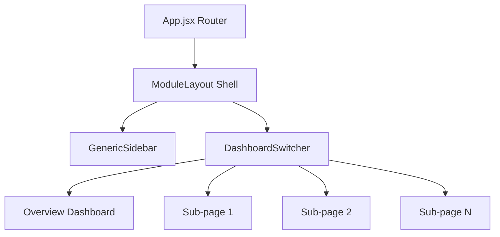
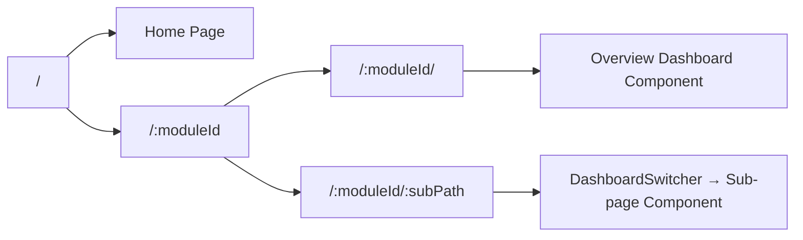

# AgroIndia — Complete Feature Walkthrough

> Comprehensive technical report covering every feature, workflow, and internal mechanism of the **AI Krishi Saathi (AI Agriculture Assistant)**, **Crop Recommendation**, and **Disease Detection** modules.

---

## Module Architecture Overview

The AgroIndia platform uses a modern, unified shell architecture to deliver high-fidelity interactive agronomical tools:



- **Routing**: `App.jsx` captures `/:moduleId/:subPath?` and passes both parameters to `DashboardSwitcher`, which mounts the corresponding modular child component.
- **Layout**: `ModuleLayout.jsx` provides the persistent navbar, sidebar, and farmer profile chrome; child pages render within a scrollable `#module-scroll-container`.
- **Sidebar**: [GenericSidebar.jsx](file:///d:/HARIOM/Documents/AventIQ/agro-analytics/frontend/src/components/sidebar/GenericSidebar.jsx) dynamically reads navigation menu definitions from [dashboardContent.js](file:///d:/HARIOM/Documents/AventIQ/agro-analytics/frontend/src/content/dashboardContent.js) keyed by the active `moduleId`. It features a browser `sessionStorage` fallback tracking mechanism (`lastActiveModule`) that preserves the active module's sidebar menu even when the farmer temporarily navigates out of the active module context (e.g. into `/module/profile`).
- **Location & Soil Telemetry**: The shared, premium compound `<LocationSelector />` component dynamically resolves geolocated and database-mapped farmer plots, updating soil pH, NPK profiles, and weather stations seamlessly.

---

# 🌾 Module 1 — Crop Recommendation

**Module ID**: `crop-recommendation`  
**Total Sub-pages**: 8 (1 dashboard + 7 tools)  
**Sidebar Menu Source**: `dashboardContent.sidebarMenus["crop-recommendation"]`

---

## 1.1 Crop Recommendation Dashboard (Overview)

- **File**: [CropRecommendationDashboard.jsx](file:///d:/HARIOM/Documents/AventIQ/agro-analytics/frontend/src/pages/crop-recommendation/CropRecommendationDashboard.jsx)
- **Route**: `/crop-recommendation/`
- **State**: Coordinates location coordinates and weather station sync.

### What It Contains

| Section                      | Description                                                                                                                       |
| ---------------------------- | --------------------------------------------------------------------------------------------------------------------------------- |
| **Location & Soil Selector** | Compound selector card synchronizing the active database farm profile and NPK parameters.                                         |
| **Season Banner**            | Dynamic, green-tinted card displaying the AI-detected growing season and a pulsing "Telemetry Active" indicator.                  |
| **Top 3 Crop Cards**         | Grid of recommended crops with SVG circular suitability indicators, yield predictions, ROI estimates, and risk badges.            |
| **Weather Sensor Array**     | 4-panel grid showing live database weather telemetry (Temperature, Humidity, Rainfall, Wind Speed) based on geographic proximity. |

### How It Works

1. **Compound Field Sync**: Toggling the farm selection in `<LocationSelector />` updates the parent state, parsing the geocoded address to resolve baseline soil and district metrics.
2. **SVG circular indicators**: A custom progress circle renders using dynamic `strokeDasharray="${percentage}, 100"` calculations and a fixed `pathLength="100"` on `<circle>` elements, preventing clipping.
3. **Proximity Weather Station**: Queries `weatherApi.getCurrentWeather` on mount and location changes, dynamically resolving the closest active database weather station using coordinate distance calculations.
4. **Best Match Highlight**: The crop containing `isBestMatch: true` receives an elevated shadow, a green-tinted border, and a premium "RECOMMENDED" badge.

---

## 1.2 Crop Ranking Engine

- **File**: [CropRankingEngine.jsx](file:///d:/HARIOM/Documents/AventIQ/agro-analytics/frontend/src/pages/crop-recommendation/CropRankingEngine.jsx)
- **Route**: `/crop-recommendation/crop-ranking`

### What It Contains

| Section                              | Description                                                                                                      |
| ------------------------------------ | ---------------------------------------------------------------------------------------------------------------- |
| **Selector Block**                   | Compound `<LocationSelector />` card to auto-synchronize active farm parameters.                                 |
| **Farm Inputs Matrix** (Left Panel)  | Interactive form with 6 input controls including Rainfall, Temp, and Soil Type dropdowns.                        |
| **Ranked Crop Scores** (Right Panel) | Sorted scoreboard of 9 primary crops with suitabilities out of 100 and dynamic suitability explanation overlays. |

### Interactive State Management

| State Variable      | Type      | Default       | Control                                            |
| ------------------- | --------- | ------------- | -------------------------------------------------- |
| `rainfall`          | `number`  | `420`         | Range slider (100–1200 MM) / Snaps to live weather |
| `temperature`       | `number`  | `28`          | Range slider (10–45°C) / Snaps to live weather     |
| `soilType`          | `string`  | `'Loamy'`     | Dropdown (7 soil structures)                       |
| `waterAvailability` | `string`  | `'Medium'`    | 3-button radio group                               |
| `landArea`          | `number`  | `5`           | Range slider (0.5–50 acres)                        |
| `district`          | `string`  | `'Faridabad'` | Dropdown (8 districts)                             |
| `isCalculating`     | `boolean` | `false`       | Spinner indicator when recalculating               |

### How It Works

1. **Weather Proximity Snapping**: Changing the farm location queries coordinate-proximity weather records from the database, instantly sliding/snapping the temperature and rainfall range sliders to match.
2. **Interactive Debouncing**: Utilizes a 450ms zero-dependency timeout debounce inside a `useEffect` hook to prevent rapid duplicate REST calls during slider drags.
3. **Backend Scoring API**: Queries `POST /api/crop-ranking` with soil types, rainfall, and priority weights. The backend agronomical model processes these against optimal plant ranges to return exact rank percentages and bilingual explanations.
4. **Suitability Bar Chart**: Progress bars are styled with harmonic, high-contrast desaturated colors. All text elements are darkened by exactly +100 for enhanced contrast and accessibility.

---

## 1.3 Seasonal Agronomic Calendar

- **File**: [SeasonalCalendar.jsx](file:///d:/HARIOM/Documents/AventIQ/agro-analytics/frontend/src/pages/crop-recommendation/SeasonalCalendar.jsx)
- **Route**: `/crop-recommendation/seasonal-calendar`

### What It Contains

| Section                        | Description                                                                         |
| ------------------------------ | ----------------------------------------------------------------------------------- |
| **Season Segmented Tabs**      | 3-tab toggle: Kharif (खरीफ), Rabi (रबी), Zaid (जायद).                               |
| **Climate Parameter Cards**    | 3-card row mapping Avg Temperature, Avg Humidity, and overall Agronomic guidelines. |
| **Rotational Calendar Matrix** | Full-width Gantt timeline mapping crop cycles × months × active farming phases.     |

### How It Works

1. **Location Selector Sync**: Mounted `<LocationSelector />` enables direct synchronization of farm coordinates, updating seasonal temperature scope ranges and timelines dynamically.
2. **AI API Integration**: Toggling season tabs or farm districts queries `getSeasonalCalendar` from `geminiService.js`, populating the Gantt table dynamically from Gemini or cascading to robust offline calendar fallbacks.
3. **Timeline Phasing**: Gantt cells render phase badges styled with desaturated greens (Sowing), blues (Irrigation), ambers (Fertilizer), and deep emeralds (Harvest).

---

## 1.4 Yield & ROI Predictor

- **File**: [YieldRoiPredictor.jsx](file:///d:/HARIOM/Documents/AventIQ/agro-analytics/frontend/src/pages/crop-recommendation/YieldRoiPredictor.jsx)
- **Route**: `/crop-recommendation/yield-roi`

### What It Contains

| Section                     | Description                                                                                                                           |
| --------------------------- | ------------------------------------------------------------------------------------------------------------------------------------- |
| **Simulation Panel** (Left) | Crop selector chips, acreage inputs, seed grades, and fertilizer budget sliders.                                                      |
| **Outcomes Panel** (Right)  | Dynamic ledger including Projected Yield, Net Profit, Downside Margin warning alerts, break-even thresholds, and KCC loan advisories. |

### How It Works

1. **Explicit Simulation Trigger**: To prevent duplicate fetches during slider adjustments, auto-update is bypassed. The farmer configures settings and clicks the premium **"Apply Simulation"** button.
2. **Dynamic Math Model**: Computes total production costs, seed quality bonuses, and fertilizer yield multipliers (optimal between ₹3,000 and ₹5,000/acre).
3. **Risk & Subsidy Alerts**: Displays down-side risk warnings if costs approach gross yields, alongside custom KCC credit advisories and regional crop subsidy tags.

---

## 1.5 Multi-Crop Comparison Matrix

- **File**: [MultiCropCompare.jsx](file:///d:/HARIOM/Documents/AventIQ/agro-analytics/frontend/src/pages/crop-recommendation/MultiCropCompare.jsx)
- **Route**: `/crop-recommendation/crop-compare`

### What It Contains

| Section                          | Description                                                                                  |
| -------------------------------- | -------------------------------------------------------------------------------------------- |
| **Comparison Table** (Left)      | Detailed 7-attribute matrix comparing Suitability, Yield, ROI, Water Need, and Harvest Days. |
| **Radar Index pentagon** (Right) | Custom SVG pentagon radar chart overlaying performance polygons (no heavy chart packages).   |

---

## 1.6 Pest & Disease Risk Scanner

- **File**: [PestRiskDetection.jsx](file:///d:/HARIOM/Documents/AventIQ/agro-analytics/frontend/src/pages/crop-recommendation/PestRiskDetection.jsx)
- **Route**: `/crop-recommendation/pest-risk`

### What It Contains

- **Parameters Bar**: Crop selector + Growth Stage capsules.
- **Risk Table**: 5 common crop pests with probability indicators and dynamic, interactive sound-mute alert bells.
- **University Recommendations**: Certified crop seeds grid (e.g., PBW 343, HD 2967) with specific pest-resistance details.

---

## 1.7 Market Demand & Mandi Analytics

- **File**: [MarketDemand.jsx](file:///d:/HARIOM/Documents/AventIQ/agro-analytics/frontend/src/pages/crop-recommendation/MarketDemand.jsx)
- **Route**: `/crop-recommendation/market-demand`

### What It Contains

- **30-Day Wholesale Chart**: Responsive `recharts` `LineChart` illustrating Mandi price fluctuations.
- **Regional Mandi Ledger**: Price tables mapping best wholesale mandis (Azadpur, Karnal, Ludhiana) with dynamic, positive percentage badges.

---

## 1.8 Historical Farm Journal

- **File**: [FarmJournal.jsx](file:///d:/HARIOM/Documents/AventIQ/agro-analytics/frontend/src/pages/crop-recommendation/FarmJournal.jsx)
- **Route**: `/crop-recommendation/farm-journal`

### What It Contains

| Section                            | Description                                                                                                               |
| ---------------------------------- | ------------------------------------------------------------------------------------------------------------------------- |
| **Outcomes Log Form** (Left)       | Complete input form to log acreage, season cost, actual yield (Qtl), gross revenue, and optional soil pH/Nitrogen levels. |
| **Yield Benchmarking HUD** (Right) | Regional comparative stats demonstrating gaps (+/- %) against district and national yield indices.                        |
| **Performance Ledger Table**       | Collapsible cropping history ledger with inline delete buttons and calculated ROI metrics.                                |
| **Soil Chemistry Curves**          | Custom SVG line plot rendering historical pH and Nitrogen levels over consecutive seasons.                                |

### How It Works

1. **Validation Constraints**: Form submissions validate input entries, immediately blocking negative values or empty fields.
2. **Yield Gaps Analysis**: The benchmarking section dynamically computes logged crop yields against Ludhiana/Faridabad regional baselines to suggest custom organic crop rotations.
3. **Custom SVG Chemistry Curve**: Connects historical soil pH and nitrogen metrics into smooth SVG paths, drawing data indicators and labels dynamically.

---

# 🦠 Module 2 — Disease Detection

**Module ID**: `disease-detection`  
**Total Sub-pages**: 8 (1 dashboard + 7 tools)  
**Sidebar Menu Source**: `dashboardContent.sidebarMenus["disease-detection"]`

---

## 2.1 Pest & Disease Risk Dashboard (Overview)

- **File**: [PestDiseaseDashboard.jsx](file:///d:/HARIOM/Documents/AventIQ/agro-analytics/frontend/src/pages/disease-detection/PestDiseaseDashboard.jsx)
- **Route**: `/disease-detection/`

### What It Contains

- **Critical Alert Card**: Red pulsing warnings highlighting top infection threats in the selected district.
- **Today's Outbreak Ledger**: Grid table detailing Crop, Active Pathogen, Severity, and Recommended Treatment.
- **Weather Threat Matrix**: 4-card grid showing wind, humidity, and precipitation thresholds alongside pathogen acceleration levels.

---

## 2.2 AI Leaf Scanner & Image Diagnosis

- **File**: [LeafScanner.jsx](file:///d:/HARIOM/Documents/AventIQ/agro-analytics/frontend/src/pages/disease-detection/LeafScanner.jsx)
- **Route**: `/disease-detection/leaf-scanner`

### What It Contains

| Section                       | Description                                                                                                                                                                                                          |
| ----------------------------- | -------------------------------------------------------------------------------------------------------------------------------------------------------------------------------------------------------------------- |
| **Preset Sample Deck**        | Interactive grid buttons with high-quality crop leaf presets (Rice Blast Leaf Spot, Wheat Yellow Rust, Tomato Early Blight) drawn in fully premium, custom SVGs.                                                     |
| **Image Upload Canvas**       | File drag-and-drop zone allowing farmers to drag in or manually select an image from their local filesystem.                                                                                                         |
| **Cellular Analyzer Preview** | Multi-layer canvas showing image preview, standard image controls, and a sliding green neon laser scanning overlay during execution.                                                                                 |
| **Diagnostic Report Sheet**   | Rendered only after successful analysis, carrying all 16 JSON report cards: plant name, health status, severity, symptoms list, possible causes, recovery checklist, treatments, and simple bilingual farmer advice. |

### How It Works

1. **Base64 Payload Reader**: Converts files selected via drag-and-drop or file upload instantly into base64 segments.
2. **Preset Ingestion**: Clicking one of the vector leaf samples immediately loads its respective path data and metadata parameters, providing high-fidelity instant testing.
3. **AI Vision Dispatcher**: Tapping "Run AI Pathological Scan" triggers `diagnosePlantLeafImage` inside `diseaseGeminiService.js`, sending the base64 payload to the `gemini-1.5-flash` model.
4. **Resilient Local Seed Fallbacks**: Cascades automatically to fully offline reference data models if the API is offline or key parameters are missing, ensuring 100% UI stability.

---

## 2.3 Risk Prediction Engine

- **File**: [RiskPredictionEngine.jsx](file:///d:/HARIOM/Documents/AventIQ/agro-analytics/frontend/src/pages/disease-detection/RiskPredictionEngine.jsx)
- **Route**: `/disease-detection/risk-prediction`

### What It Contains

| Section                             | Description                                                                        |
| ----------------------------------- | ---------------------------------------------------------------------------------- |
| **Inputs Panel** (Left)             | Farm dropdown, growth stage pills, and temperature/humidity/rainfall sliders.      |
| **Semicircular Dial Gauge** (Right) | SVG semicircular gauge showing composite risk percentages with an animated needle. |
| **Infection Breakdown & Actions**   | Real-time pathogen probabilities and corresponding spray actions.                  |

### How It Works

1. **Compound Field Integration**: Seamlessly maps pincode-based NPK soil telemetry and geolocation vectors when the active farm changes.
2. **SVG Dial Rotation**: Needle rotation follows the formula: `rotate(-90 + score * 1.8)` based on composite risk percentages.
3. **AI Inference Dispatcher**: Clicking "Run AI Analysis" displays gray skeleton loaders and queries `getRiskPrediction` from `diseaseGeminiService.js`.

---

## 2.4 Region Heatmap

- **File**: [RegionHeatmap.jsx](file:///d:/HARIOM/Documents/AventIQ/agro-analytics/frontend/src/pages/disease-detection/RegionHeatmap.jsx)
- **Route**: `/disease-detection/heatmap`

### What It Contains

- **SVG Interactive Outline Canvas**: Topographic outline map of India with national-to-state SVG path drill-downs.
- **Pulsing Outbreak Nodes**: Translucent radial nodes (`rgba(220,38,38,0.35)`) mapping active crop infestation hot-spots.
- **Outbreak Insights Panel**: Zoomed-in district logs rendering detailed regional severity badges.

---

## 2.5 Treatment Advisor

- **File**: [TreatmentAdvisor.jsx](file:///d:/HARIOM/Documents/AventIQ/agro-analytics/frontend/src/pages/disease-detection/TreatmentAdvisor.jsx)
- **Route**: `/disease-detection/treatment`

### What It Contains

- **Protocol search**: Input query filters parsing chemical vs organic therapeutic options.
- **Action Calendars**: 30-day interactive spray calendars highlighting specific treatment days (e.g., Days 1, 5, 12, 18, 26).

---

## 2.6 Crop Lifecycle Tracker

- **File**: [CropLifecycle.jsx](file:///d:/HARIOM/Documents/AventIQ/agro-analytics/frontend/src/pages/disease-detection/CropLifecycle.jsx)
- **Route**: `/disease-detection/lifecycle`

### What It Contains

- **Horizontal Progress timeline**: Custom horizontal SVG stem mapping six growth stages (Seed ──> Germination ──> Vegetative ──> Flowering ──> Maturity ──> Harvest).
- **Predictive timeline connection**: Animates connecting progress fills using the calculation: `((currentStageIndex + 0.5) / stages.length) * 100`.
- **Field Checklist Accordions**: Toggles crop-stage tasks mapped directly to localized agronomist databases.

---

## 2.7 Outbreak History Log

- **File**: [HistoricalOutbreaks.jsx](file:///d:/HARIOM/Documents/AventIQ/agro-analytics/frontend/src/pages/disease-detection/HistoricalOutbreaks.jsx)
- **Route**: `/disease-detection/history`

### What It Contains

- **Timeline Log Cards**: Chronological historical outbreak list (April–August 2025) with left-bordered severity codes (Red: High, Amber: Moderate, Green: Low).
- **Aggregate Scoreboards**: Dynamic metrics summarizing Total Outbreaks, Total Affected Area, and Most Common Disease.

---

# 🤖 Module 3 — AI Krishi Saathi (AI Agriculture Assistant)

**Module ID**: `ai-suggestion`  
**Total Sub-pages**: 5 (1 assistant + 4 tools)  
**Sidebar Menu Source**: `dashboardContent.sidebarMenus["ai-suggestion"]`

---

## 3.1 AI Agriculture Assistant (Conversational Agronomist)

- **File**: [AiAssistant.jsx](file:///d:/HARIOM/Documents/AventIQ/agro-analytics/frontend/src/pages/ai-suggestion/AiAssistant.jsx)
- **Route**: `/ai-suggestion/`

### What It Contains

| Section                       | Description                                                                          |
| ----------------------------- | ------------------------------------------------------------------------------------ |
| **Location Context Selector** | Integrates compound `<LocationSelector />` syncing dynamic coords and soil profiles. |
| **Language Preference Bar**   | Horizontal selector toggle supporting Hindi, English, Punjabi, Tamil, and Telugu.    |
| **Conversation Workspace**    | Interactive scrollable chat feed with auto-scroll-to-bottom features.                |
| **Suggestions capsules**      | Pre-seeded quick prompt suggestions (e.g., _"NPK ratio for rice in July"_).          |

### How It Works

1. **Dynamic Prompt Context Injection**: Chat prompts query `generateContent` in `client.js`. The prompt builder dynamically compiles active state, district, soil type, pH, Nitrogen, Phosphorus, and Potassium levels into the system instructions:
   ```
   You are Senior AI Krishi Saathi, an agronomist assistant...
   User location: Ludhiana, Punjab. Soil pH: 6.8, Nitrogen: 270 kg/ha.
   ```
2. **Romanized Transliteration (Hinglish)**: Instructs Gemini to respond in Romanized transliterated Hindi (Hinglish) alongside a direct English translation on a new line.
3. **Robust Keyword Fallback**: If the API key is missing or encounters runtime limits, the system catches the failure, matching input keywords (e.g., `wheat`/`gehun`, `rice`/`dhaan`, `pest`/`disease`) to serve highly personalized agronomical database answers.

---

## 3.2 Irrigation Scheduler

- **File**: [IrrigationScheduler.jsx](file:///d:/HARIOM/Documents/AventIQ/agro-analytics/frontend/src/pages/ai-suggestion/IrrigationScheduler.jsx)
- **Route**: `/ai-suggestion/irrigation`

### What It Contains

| Section                       | Description                                                                                          |
| ----------------------------- | ---------------------------------------------------------------------------------------------------- |
| **Interactive Grid Calendar** | 30-day interactive scheduling calendar illustrating Mon-Sun weekdays.                                |
| **Day Status detail strip**   | Details target water volumes (e.g., "5.5mm volume delivery") when clicking any active calendar cell. |
| **Soil Moisture donut gauge** | Sizable radial circle progress ring outlining active deficit percentages.                            |
| **Water Saving Tips**         | Interactive warning banners describing micro-irrigation guidelines.                                  |

### How It Works

1. **Dynamic Fetching**: Toggling the crop select, growth stage, or farm location invokes `getIrrigationSchedule` from `geminiService.js`, dynamically modifying calendar scheduled (emerald) and optional (lime) days.
2. **SVG Donut calculations**: Progress circle renders using standard trigonometric stroke displacement math:
   `const strokeDashoffset = circumference * (1 - moisture / 100);`

---

## 3.3 Fertilizer Planner

- **File**: [FertilizerPlanner.jsx](file:///d:/HARIOM/Documents/AventIQ/agro-analytics/frontend/src/pages/ai-suggestion/FertilizerPlanner.jsx)
- **Route**: `/ai-suggestion/fertilizer`

### What It Contains

- **Spatial Telemetry Sync Strip**: MapPin baseline tracker showing selected coordinates alongside active telemetry indicators.
- **NPK target progress charts**: Live comparative horizontal nutrient target bars.
- **Pulsing Nitrogen Alert**: An excess chemical alert banner highlighting crop-burning risks when Nitrogen bounds cross baseline tolerances.
- **4-Step Schedule Grids**: Itemized split schedules showing correct urea, DAP, or compost weights.

---

## 3.4 Mandi Price Tracker

- **File**: [MandiPriceTracker.jsx](file:///d:/HARIOM/Documents/AventIQ/agro-analytics/frontend/src/pages/ai-suggestion/MandiPriceTracker.jsx)
- **Route**: `/ai-suggestion/mandi-tracker`

### What It Contains

- **Stacked Bilingual Headers**: Title row stacked dynamically with regional translations (`मंडी भाव`).
- **Best Price Today Banner**: Full-width card with inline trend indicators and detail triggers.
- **30-Day SVG Index Plot**: Wave-scaled SVG chart illustrating daily market index fluctuations.
- **Price Alerts & Crop Rotation**: Threshold configuration fields alongside lightbulb rotation recommendations (highlighting 30% revenue increases).
- **High-Density wholesale Ledger**: Alternating hover rows mapping Azadpur, Karnal, and Ludhiana wholesaler indexes.

---

## 3.5 AI Lifecycle Guidance Engine

- **File**: [LifecyclePredictor.jsx](file:///d:/HARIOM/Documents/AventIQ/agro-analytics/frontend/src/pages/ai-suggestion/LifecyclePredictor.jsx)
- **Route**: `/ai-suggestion/lifecycle`

### What It Contains

- **4-Column Summary matrix**: Cards tracking Current Phase, Harvest Window, Yield at Risk, and Sync Status.
- **Vertical Stem timeline**: Connects 8 development milestones using checkmarks (completed) and progress gauges.
- **AI Insight Board**: Outlines key actions and warning stripes (e.g., _"Missing CRI irrigation will permanently reduce yield by 20%"_).
- **Active Stress Logs**: Weather anomalies and pathogen alerts index sidebar.

---

# 👤 Module 4 — Farmer Profile & Land Assets Registry

**Module ID**: `profile`  
**Total Sub-pages**: 1 (Consolidated Settings Page)  
**Sidebar Link**: Profile avatar action in sidebar bottom / `/module/profile`

---

## 4.1 Farmer Ledger & Profile Editor

- **File**: [Profile.jsx](file:///d:/HARIOM/Documents/AventIQ/agro-analytics/frontend/src/pages/home/Profile.jsx)
- **Route**: `/module/profile`

### What It Contains

| Section                      | Description                                                                                                                           |
| ---------------------------- | ------------------------------------------------------------------------------------------------------------------------------------- |
| **Core Identity summary**    | Horizontal panel displaying the active farmer's name, base location, pincode, and crop staples with inline edit toggle forms.         |
| **Land Assets repeater**     | Responsive 3-column grid repeating all registered agricultural land plots with active crop badges and unallocated space calculations. |
| **Asset registration modal** | Styled pop-up modal containing farm configurations, coordinates geocoders, and interactive crops sub-forms.                           |

### How It Works

1. **Modal-based farm creation**: Clicking the dashed "Add New Farm" card opens an overlay modal. The farmer inputs the farm name, selects state/district parameters, and registers crops.
2. **Sown Area constraints**: The crops sub-form dynamically tracks acreage on-the-fly (`sownArea` inputs). It enforces `sum(sownArea) <= totalLand`, blocking inputs that exceed the farm's total acreage.
3. **Database REST API Client**: Updates and deletions dispatch to Mongoose collections via backend routes (`GET /api/profile`, `PUT /api/profile`, `POST /api/profile/farms`, `PUT /api/profile/farms/:id`, `DELETE /api/profile/farms/:id`).

---

# 🏗️ Shared Infrastructure

## Routing Architecture

All routes are declared in `App.jsx`, utilizing standard React Router syntax and passing wildcard arguments to the unified switcher shell:



## Design System Tokens

The entire platform implements a desaturated green brand style sheet to convey security, trust, and premium agronomical excellence:

| Token               | Value     | Usage                                                           |
| ------------------- | --------- | --------------------------------------------------------------- |
| **Primary Darkest** | `#132a13` | Title headers, rank #1 badges, emphasis labels.                 |
| **Primary Dark**    | `#31572c` | Interactive buttons, active links, primary hover states.        |
| **Primary Mid**     | `#4f772d` | Dynamic progress fills, secondary borders, icon accents.        |
| **Primary Light**   | `#90a955` | De-emphasized indicators, inactive icons, progress backgrounds. |
| **Accent Lime**     | `#ecf39e` | Best crop recommendations, notification dots, highlight tags.   |
| **Canvas**          | `#f4f7f4` | Outer page container backgrounds.                               |
| **Card Surface**    | `#ffffff` | Elevated dashboard grids and HUD sub-cards.                     |

---

> [!TIP]
> All modules utilize a unified CSS grid format paired with dynamic fade-in animations: `<div className="space-y-6 animate-fadeIn">`. This ensures absolute visual harmony, zero horizontal layout shifts, and standard-compliant rendering across all modern mobile and desktop screens.
